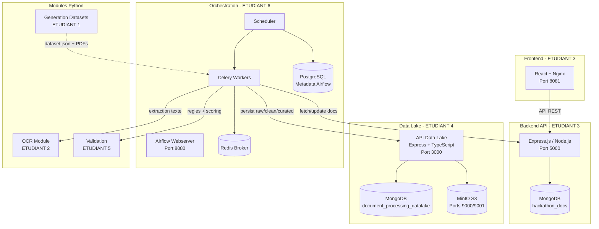

# Hackathon 2026 - Traitement Automatise de Documents Administratifs

## Groupe 28 - IPSSI

Plateforme d'automatisation du traitement de documents administratifs (factures, devis, attestations, RIB, Kbis) combinant OCR, NLP, validation metier et orchestration via Apache Airflow.

---

## Contexte

Hackathon de 4 jours visant a industrialiser le traitement de documents administratifs par IA. Le pipeline complet prend en charge : la generation de donnees de test, l'upload de documents, l'extraction OCR, la classification, la validation metier (regles + anomaly detection), le stockage en Data Lake 3 zones (Raw / Clean / Curated), et l'alimentation automatique d'un CRM et d'un outil de conformite.

---

## Equipe

| Etudiant   | Prenom           | Role                                      | Dossier                |
| ---------- | ---------------- | ----------------------------------------- | ---------------------- |
| ETUDIANT 1 | Corentin         | Generation de donnees de test             | `/data`                |
| ETUDIANT 2 | Monica, Danielle | OCR & Extraction d'informations           | `/src`                 |
| ETUDIANT 3 | Elliot           | Backend API + Frontend React              | `/backend` `/frontend` |
| ETUDIANT 4 | Aya              | Data Lake (MongoDB + MinIO)               | `/data-lake`           |
| ETUDIANT 5 | Sara             | Validation & Detection d'anomalies        | `/val`                 |
| ETUDIANT 6 | Matis            | Orchestration Airflow & Industrialisation | `/airflow`             |

| Groupe | Membres                            |
| ------ | ---------------------------------- |
| M1     | Corentin, Danielle, Elliot, Monica |
| M2     | Aya, Matis, Sara                   |

---

## Architecture Globale



---

## Pipeline DAG Airflow

```mermaid
graph LR
    A[Debut] --> B[Recuperer documents<br/>status=uploaded]
    B --> C[Passer en processing]
    C --> D[Init cache EasyOCR]
    D --> E[Extraction OCR<br/>+ Classification<br/>+ Evaluation]
    E --> F[Persister zone Clean]
    F --> G[Validation metier<br/>regles + risk scoring]
    G --> H[Persister zone Curated]
    H --> I[Envoyer CRM]
    H --> J[Envoyer Conformite]
    I --> K[Finaliser documents]
    J --> K
    K --> L[Fin]

    style A fill:#10b981,color:#fff
    style E fill:#f59e0b,color:#fff
    style G fill:#ef4444,color:#fff
    style H fill:#8b5cf6,color:#fff
    style I fill:#3b82f6,color:#fff
    style J fill:#3b82f6,color:#fff
    style L fill:#10b981,color:#fff
```



Le DAG `orchestration_dag` s'execute toutes les 2 minutes. Il recupere les documents uploades via le backend, applique l'OCR, valide les donnees, les persiste dans le Data Lake en 3 zones, puis alimente automatiquement le CRM et l'outil de conformite.

---

## Contributions par Etudiant

### ETUDIANT 1 - Generation de donnees (Corentin)

Generation de jeux de donnees realistes pour tester le pipeline complet.

- **`data/generateDataset.py`** : generation de transactions via `Faker` (locale `fr_FR`) avec scenarios d'erreurs (dates, montants)
- **`data/generatePDF.py`** : creation de factures et devis en PDF + images (PNG, JPEG) via `ReportLab` et `pdf2image`
- Scenarios inclus : documents valides, erreurs de dates, erreurs de montants, incoherences inter-documents

### ETUDIANT 2 - OCR & Extraction (Monica, Danielle)

Module d'extraction de texte et d'informations structurees depuis les documents.

- **Extraction OCR** : EasyOCR (images), PyPDF2 (PDF numeriques), conversion PDF scannes en images
- **Classification** : systeme de scoring par mots-cles (facture, devis, attestation, releve, contrat)
- **Parsing** : extraction par regex de SIRET, SIREN, montants HT/TTC, TVA, dates, IBAN, BIC, adresse
- **Evaluation** : score de qualite OCR + couverture des champs extraits

### ETUDIANT 3 - Backend API + Frontend (Elliot)

API REST et interface web pour la gestion des documents, le CRM et la conformite.

**Backend (Express.js, port 5000) :**
- Routes `/api/documents` : upload, liste, stats, mise a jour de statut
- Routes `/api/crm` : gestion clients, recherche SIRET/raison sociale, endpoint `POST /autofill`
- Routes `/api/conformite` : anomalies, scores de conformite, endpoint `POST /autofill`

**Frontend (React + Vite + Tailwind) :**
- `/upload` : drag & drop multi-fichiers, badges de statut, stats en cartes
- `/crm` : liste clients, recherche, score de conformite, fiche client detaillee
- `/conformite` : tableau d'anomalies avec filtre par severite, stats globales
- Design dark mode avec animations (Aurora, blur, magnet)

### ETUDIANT 4 - Data Lake (Aya)

Infrastructure de stockage distribue en 3 zones avec API REST complete (30+ endpoints).

- **MongoDB 7.0** : collections `raw_zone`, `clean_zone`, `curated_zone` avec index optimises
- **MinIO** : stockage S3-compatible pour les fichiers bruts (buckets `raw-zone`, `clean-zone`, `curated-zone`)
- **API TypeScript/Express (port 3000)** : CRUD complet par zone, upload multipart, detection d'incoherences inter-documents, statistiques
- Limite upload 50 MB, validation type MIME, healthchecks

### ETUDIANT 5 - Validation & Anomalies (Sara)

Moteur de validation metier et detection d'anomalies par regles et machine learning.

- **`val/rules.py`** : verification format SIRET, coherence TVA (HT * 1.2 ~ TTC), dates d'expiration
- **`val/risk_scoring.py`** : calcul de score de risque par document
- **`val/anomaly_model.py`** : detection d'anomalies par ML (Isolation Forest), avec `predict_single` et auto-bootstrap
- **`val/validator.py`** : classe `DocumentValidator` qui combine regles + scoring, retourne status/errors/risk_score/severity

### ETUDIANT 6 - Orchestration & Industrialisation (Matis)

Orchestration du pipeline complet via Apache Airflow et conteneurisation Docker.

- **DAG `orchestration_dag`** : pipeline de production en 10 etapes (fetch -> OCR -> validation -> persistence -> auto-remplissage)
- **DAG `orchestration_mock_dag`** : pipeline batch sur `dataset.json` (100 documents) pour tests sans infra
- **DAG `orchestration_mocksimu_dag`** : pipeline mono-document pour tests rapides
- **`docker-compose.yml`** : stack unifiee (Airflow + PostgreSQL + Redis + Workers Celery + Frontend + Backend + MongoDB + Data Lake + MinIO)
- **Mapping de schemas** : conversion camelCase/snake_case entre les couches (OCR -> DAG -> Backend -> Data Lake)
- **Auto-remplissage** : injection automatique des donnees validees dans le CRM et l'outil de conformite via `POST /autofill`
- **Scaling** : CeleryExecutor avec workers scalables (`--scale airflow-worker=N`)

---

## Stack Technique

| Composant        | Technologie                         |
| ---------------- | ----------------------------------- |
| Orchestration    | Apache Airflow 2.x + CeleryExecutor |
| Backend API      | Node.js / Express.js                |
| Frontend         | React 18 + Vite + Tailwind CSS      |
| Data Lake API    | Node.js / Express.js + TypeScript   |
| Base de donnees  | MongoDB 7.0                         |
| Stockage objet   | MinIO (S3-compatible)               |
| Broker           | Redis 7.2                           |
| Metadata Airflow | PostgreSQL 16                       |
| OCR              | EasyOCR + PyPDF2                    |
| ML               | scikit-learn (Isolation Forest)     |
| Generation       | Faker + ReportLab + pdf2image       |
| Conteneurisation | Docker / Docker Compose             |

---

## Demarrage Rapide

### Prerequis

- Docker & Docker Compose
- (Optionnel) Python 3.10+ avec venv pour les scripts de generation

### Lancer toute l'infrastructure

```bash
cd hackathon_2026

# demarrer les services de base (frontend + backend + datastores)
docker compose -f airflow/docker-compose.yml up -d --build mongo backend datalake minio frontend

# initialiser Airflow (migration BDD + creation compte admin)
docker compose -f airflow/docker-compose.yml up airflow-init

# demarrer Airflow
docker compose -f airflow/docker-compose.yml up -d airflow-webserver airflow-scheduler airflow-worker
```

### Acces aux interfaces

| Service       | URL                   | Identifiants            |
| ------------- | --------------------- | ----------------------- |
| Airflow       | http://localhost:8080 | admin / admin           |
| Frontend      | http://localhost:8081 | -                       |
| Backend API   | http://localhost:5000 | -                       |
| Data Lake API | http://localhost:3000 | -                       |
| MinIO Console | http://localhost:9001 | minioadmin / minioadmin |

### Arreter

```bash
docker compose -f airflow/docker-compose.yml down          # conserver les volumes
docker compose -f airflow/docker-compose.yml down --volumes # reset complet
```

---

## Comment Tester Chaque Partie

### ETUDIANT 1 - Generation de donnees

```bash
cd data
pip install faker reportlab pdf2image
python generateDataset.py    # genere dataset.json
python generatePDF.py        # genere les PDF/images dans data/pdf/
```

### ETUDIANT 2 - Module OCR

```bash
pip install easyocr PyPDF2 python-docx
cd src
python -m ocr_module.main --input ../data/pdf/facture_001.pdf
```

### ETUDIANT 3 - Backend + Frontend

```bash
# backend
cd backend && npm install && npm start    # http://localhost:5000/api/health

# frontend
cd frontend && npm install && npm run dev # http://localhost:5173
```

### ETUDIANT 4 - Data Lake

```bash
cd data-lake
npm install
npm run docker:up    # MongoDB + MinIO
npm run dev          # http://localhost:3000/health

# tests automatises
./test-datalake.ps1  # Windows
./test-datalake.sh   # Linux/Mac
```

### ETUDIANT 5 - Validation

```bash
cd val
python -c "
from validator import DocumentValidator
v = DocumentValidator()
print(v.validate({
    'siret': '12345678901234',
    'montant_ht': 100,
    'montant_ttc': 120,
    'date_expiration': '2027-01-01'
}))
"
```

### ETUDIANT 6 - DAG Airflow

```bash
# tester le DAG mock (100 documents, sans infra externe)
docker compose -f airflow/docker-compose.yml exec airflow-webserver \
  airflow dags test orchestration_mock_dag 2026-03-17

# tester le DAG simu (1 document)
docker compose -f airflow/docker-compose.yml exec airflow-webserver \
  airflow dags test orchestration_mocksimu_dag 2026-03-17

# tester le DAG production (necessite backend + datalake up)
docker compose -f airflow/docker-compose.yml exec airflow-webserver \
  airflow dags test orchestration_dag 2026-03-17
```

---

## Axes d'Amelioration

| Domaine       | Amelioration possible                                                                              |
| ------------- | -------------------------------------------------------------------------------------------------- |
| OCR           | Passer a un modele NER (spaCy / Transformers) pour une extraction plus robuste                     |
| OCR           | Evaluer la qualite OCR par comparaison avec un ground truth reel (actuellement score fixe a 1)     |
| Validation    | Enrichir le modele d'anomalies avec plus de features (types de documents, dates, cross-validation) |
| Validation    | Ajouter la comparaison inter-documents (facture vs devis, SIRET vs attestation)                    |
| Data Lake     | Mise en place d'un replica set MongoDB pour la haute disponibilite                                 |
| Data Lake     | Cluster MinIO multi-noeud pour la scalabilite du stockage                                          |
| Securite      | Authentification JWT sur les APIs backend et data-lake                                             |
| Securite      | Chiffrement des documents sensibles dans MinIO                                                     |
| Frontend      | Visualisation du pipeline en temps reel (statut par etape)                                         |
| Frontend      | Notifications push lors du traitement d'un document                                                |
| Orchestration | Ajout de sensors Airflow pour declencher le DAG sur evenement (nouveau document uploade)           |
| Orchestration | Metriques et alertes (Prometheus / Grafana) sur les taux d'erreur du pipeline                      |
| Orchestration | Retry plus granulaire par type d'erreur (OCR timeout vs validation failure)                        |
| Generation    | Augmenter la variete des scenarios (documents floutes, multi-pages, langues mixtes)                |
| Global        | CI/CD avec tests automatises avant deploiement                                                     |
| Global        | Gestion des secrets via Vault ou variables d'environnement securisees                              |

---

## Arborescence du Projet

```
hackathon_2026/
|-- airflow/                  # ETUDIANT 6 - Orchestration
|   |-- docker-compose.yml    # Stack unifiee (Airflow + Backend + MongoDB + MinIO)
|   |-- Dockerfile
|   |-- dags/
|   |   |-- orchestration_dag.py         # DAG production
|   |   |-- orchestration_mock_dag.py    # DAG batch test (100 docs)
|   |   |-- orchestration_mocksimu_dag.py # DAG mono-document
|   |   |-- tasks/
|   |       |-- helpers.py               # Config, HTTP, conversions
|   |       |-- mapping.py              # Transformations entre couches
|   |       |-- steps.py                # Callables des 10 etapes
|   |-- logs/
|   |-- cache/easyocr/
|
|-- backend/                  # ETUDIANT 3 - API
|   |-- src/
|       |-- index.js
|       |-- routes/           # documents, crm, conformite
|       |-- controllers/      # documentController, crmController, conformiteController
|       |-- models/           # Document, Client
|
|-- frontend/                 # ETUDIANT 3 - Interface web
|   |-- src/
|       |-- App.jsx
|       |-- pages/            # Upload, CRM, ClientDetail, Conformite
|       |-- components/       # Sidebar, cartes, etc.
|       |-- api/
|
|-- data/                     # ETUDIANT 1 - Generation
|   |-- generateDataset.py
|   |-- generatePDF.py
|   |-- dataset.json
|   |-- pdf/
|
|-- data-lake/                # ETUDIANT 4 - Stockage
|   |-- src/index.ts
|   |-- docker-compose.yml    # MongoDB + MinIO standalone
|   |-- tests/
|
|-- src/                      # ETUDIANT 2 - OCR
|   |-- ocr_module/
|       |-- extractor.py      # Extraction texte
|       |-- classifier.py     # Classification documents
|       |-- parser.py         # Extraction champs structures
|       |-- evaluator.py      # Score de qualite
|       |-- main.py           # CLI
|
|-- val/                      # ETUDIANT 5 - Validation
|   |-- validator.py          # Classe DocumentValidator
|   |-- rules.py              # Regles metier (SIRET, TVA, dates)
|   |-- risk_scoring.py       # Score de risque
|   |-- anomaly_model.py      # Detection ML (Isolation Forest)
|
|-- simu/                     # Scripts de simulation
|   |-- input/mock_ocr.json
|   |-- output/
```
