# Project Database Schema

# 📊 SCHÉMA BASE DE DONNÉES - DIAGRAMMES MERMAID

## 🏗️ Architecture Globale du Data Lake

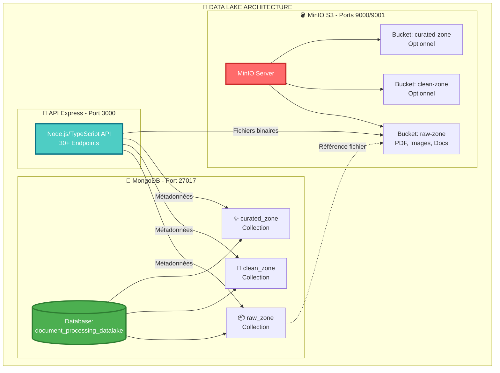

---

## 🔄 Flux de Données entre Collections

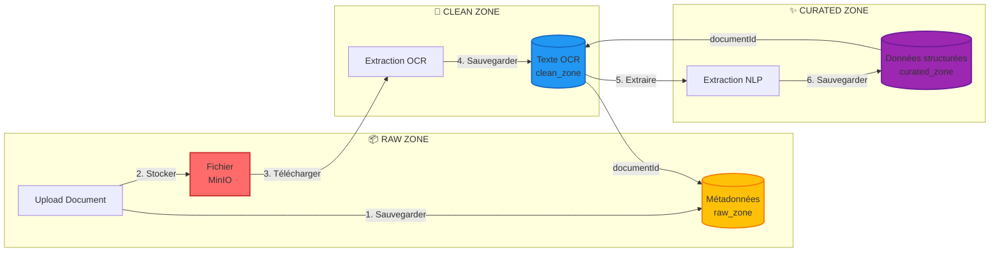

---

## 📋 Schéma Entité-Relation (ERD)

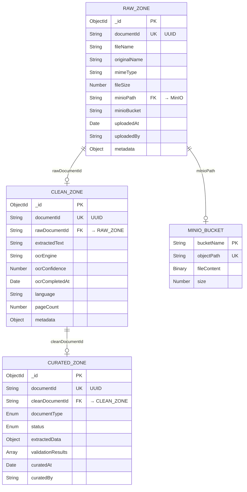

---

## 🎯 Cycle de Vie d'un Document

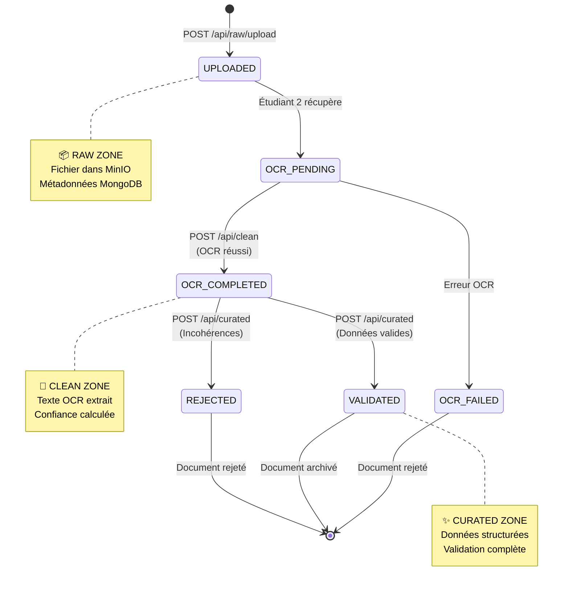

---

## 📊 Structure Détaillée: raw_zone

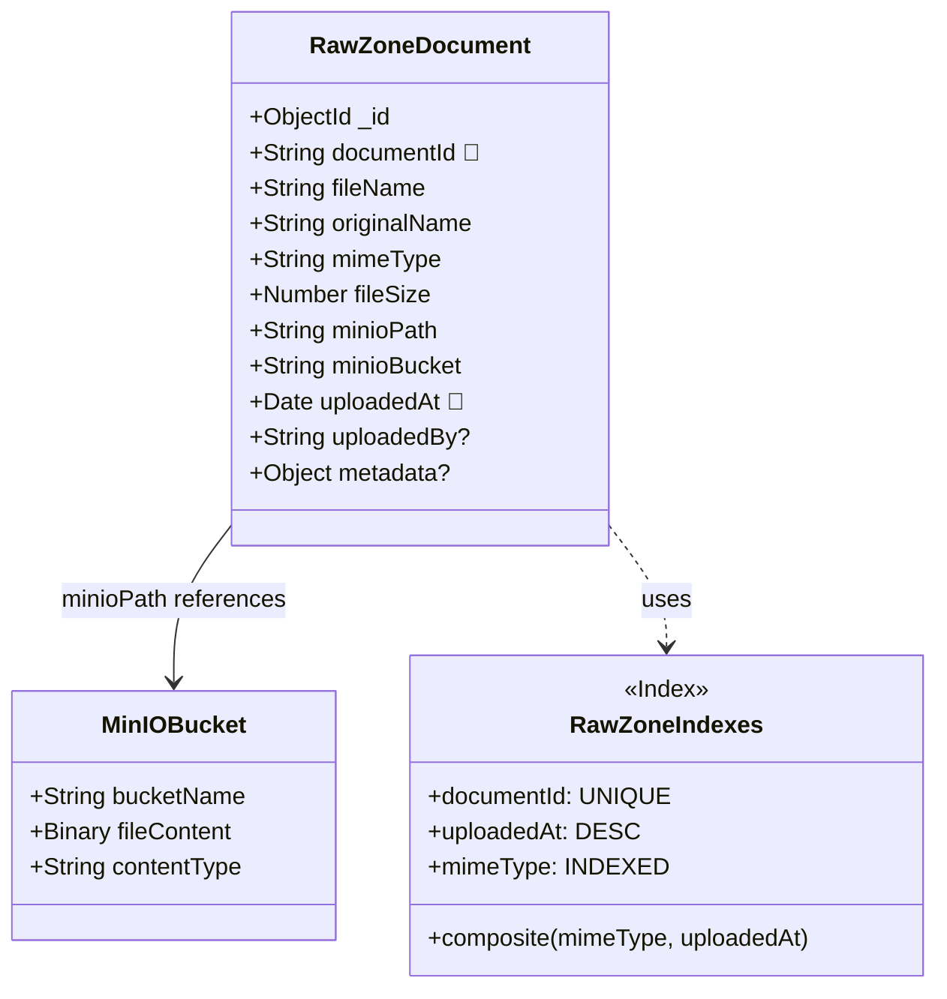

---

## 🧹 Structure Détaillée: clean_zone

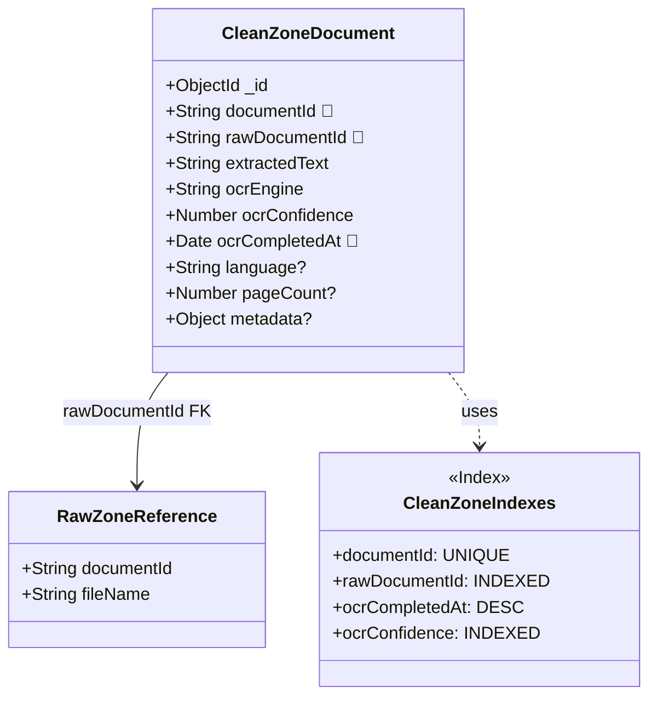

---

## ✨ Structure Détaillée: curated_zone

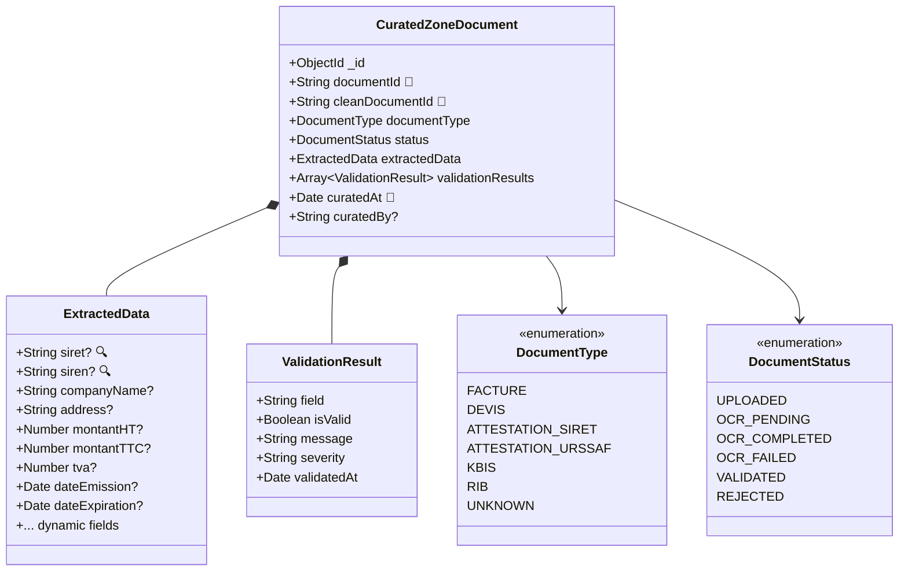

---

## 🔍 Requêtes Principales (Flux de données)

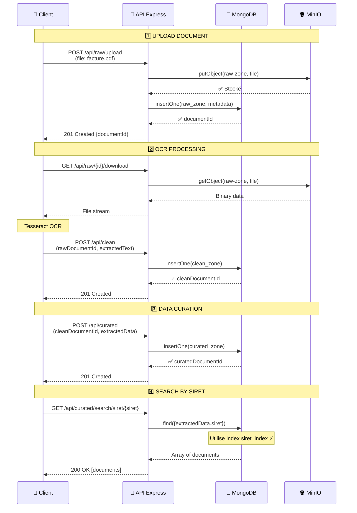

---

## 📈 Diagramme de Déploiement (Infrastructure)

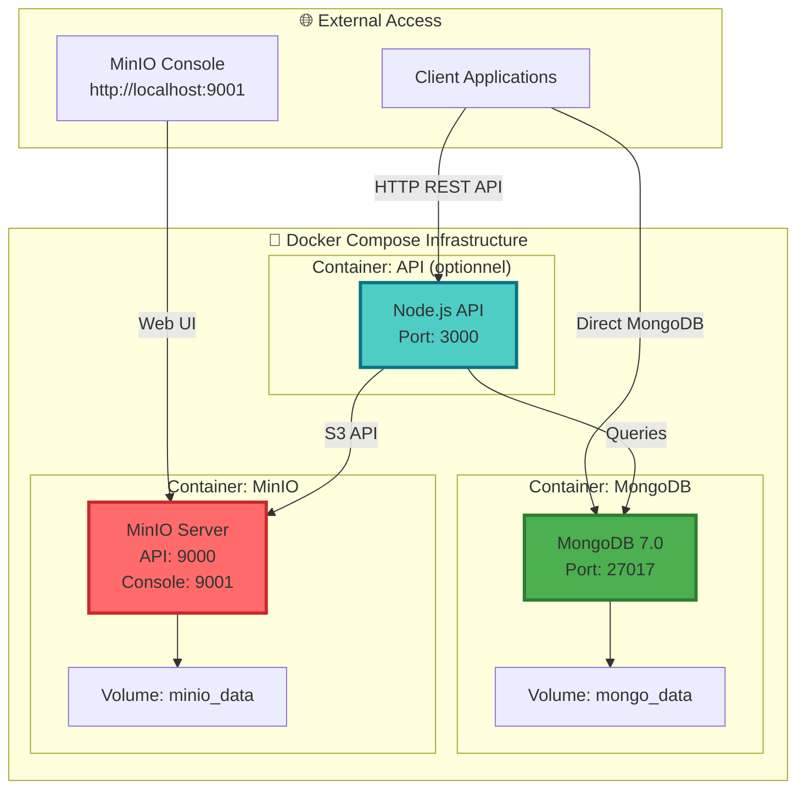

---

## 🔐 Diagramme de Sécurité JWT (avec auth.middleware.ts)

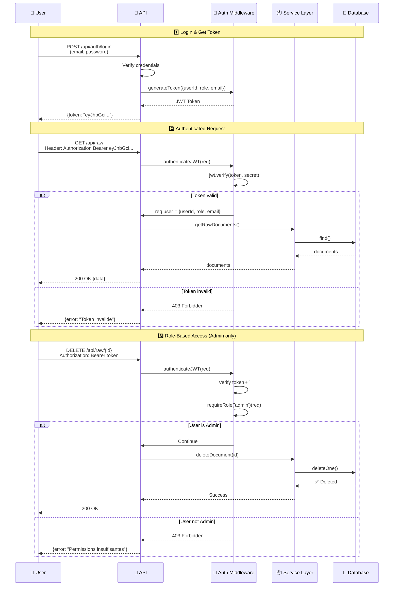

---

## 📊 Diagramme de Monitoring (MetricsCollector)

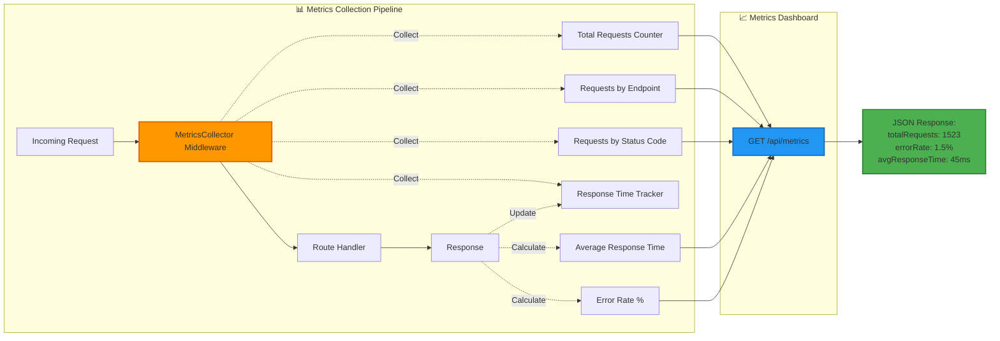

---

## 🧪 Diagramme de Test (Tests Unitaires & Intégration)

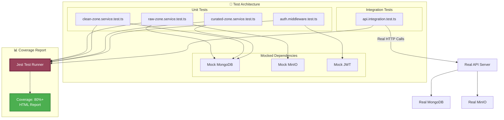

---

## 🎯 Diagramme d'Intégration avec les Autres Modules

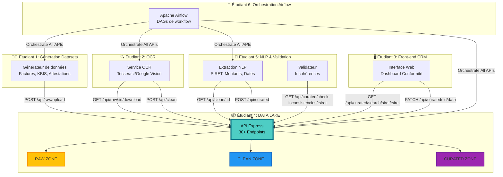

---

## 🔄 Workflow Complet: De l'Upload à la Validation

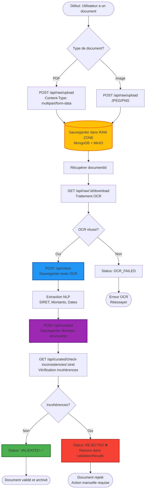

---

## 📊 Diagramme de Performance: Index MongoDB

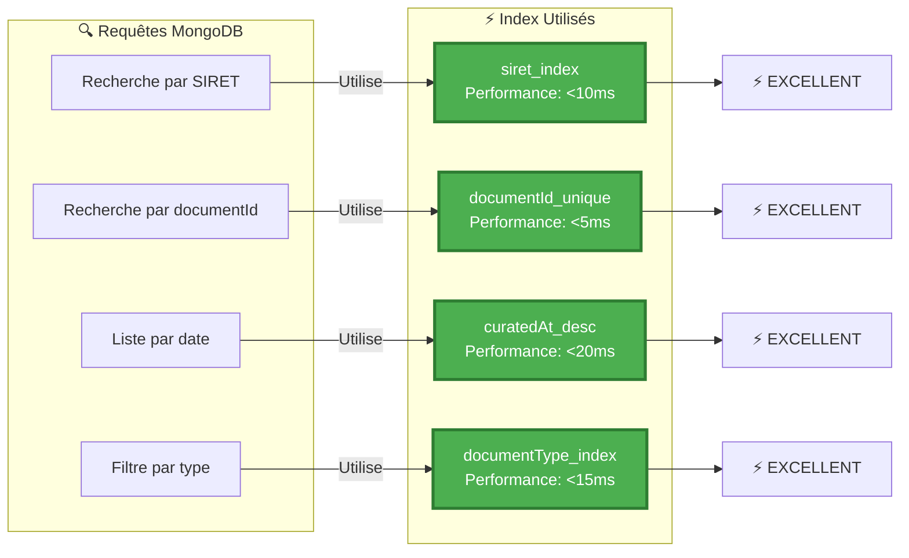

---

## 🎨 Légende des Symboles

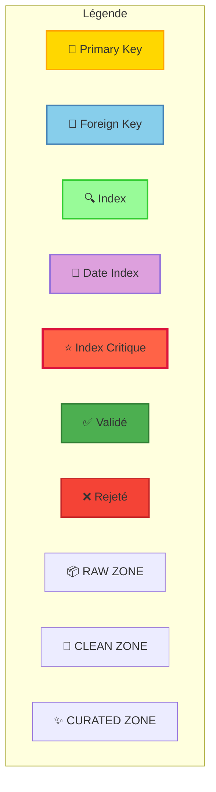

---

## ✅ Résumé des Diagrammes

| Diagramme | Type | Description |
|-----------|------|-------------|
| Architecture Globale | Graph | Vue d'ensemble MongoDB + MinIO + API |
| Flux de Données | Flowchart | Cycle RAW → CLEAN → CURATED |
| ERD | Entity-Relationship | Relations entre collections |
| Cycle de Vie | State Diagram | États d'un document |
| Structures Détaillées | Class Diagram | Schémas des 3 collections |
| Requêtes | Sequence Diagram | Interactions API/DB/MinIO |
| Déploiement | Graph | Infrastructure Docker |
| Sécurité JWT | Sequence Diagram | Authentification et rôles |
| Monitoring | Graph | Collecte de métriques |
| Tests | Graph | Architecture de tests |
| Intégration | Graph | Liens avec autres modules |
| Workflow Complet | Flowchart | Process de A à Z |
| Performance | Graph | Index et temps de réponse |

---

**📊 Créé par : Étudiant 4 - Data Lake Module**  
**12 diagrammes Mermaid interactifs**  
**Compatible GitHub, GitLab, VSCode**  
**Rendu automatique dans Markdown viewers**
